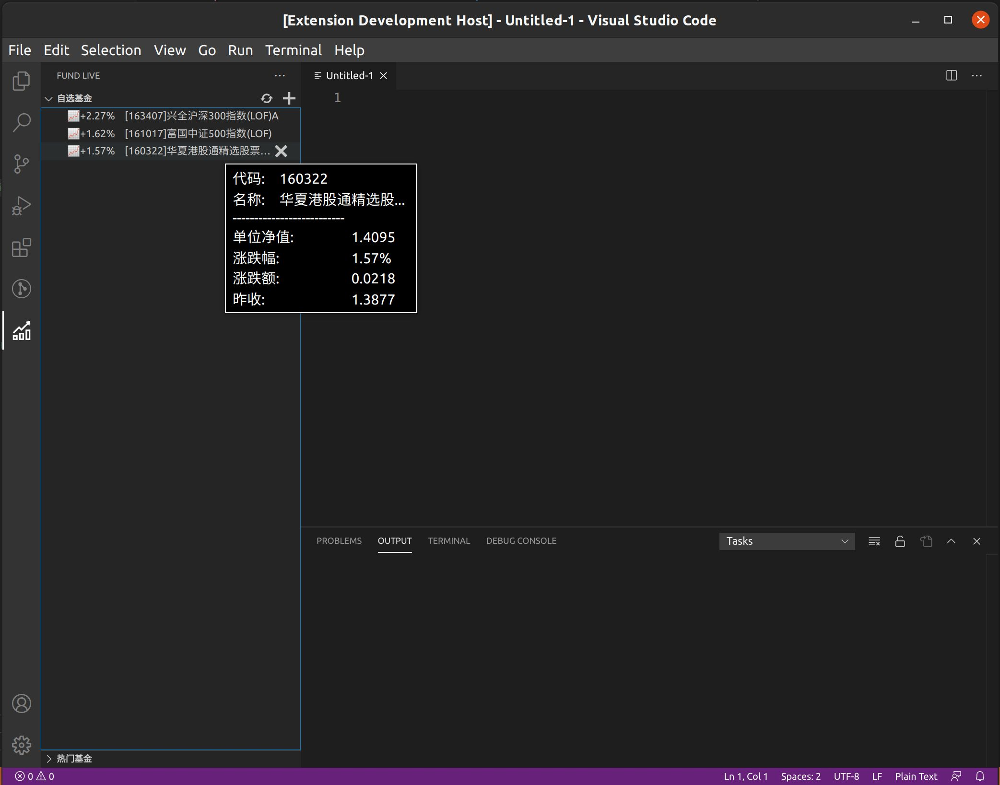
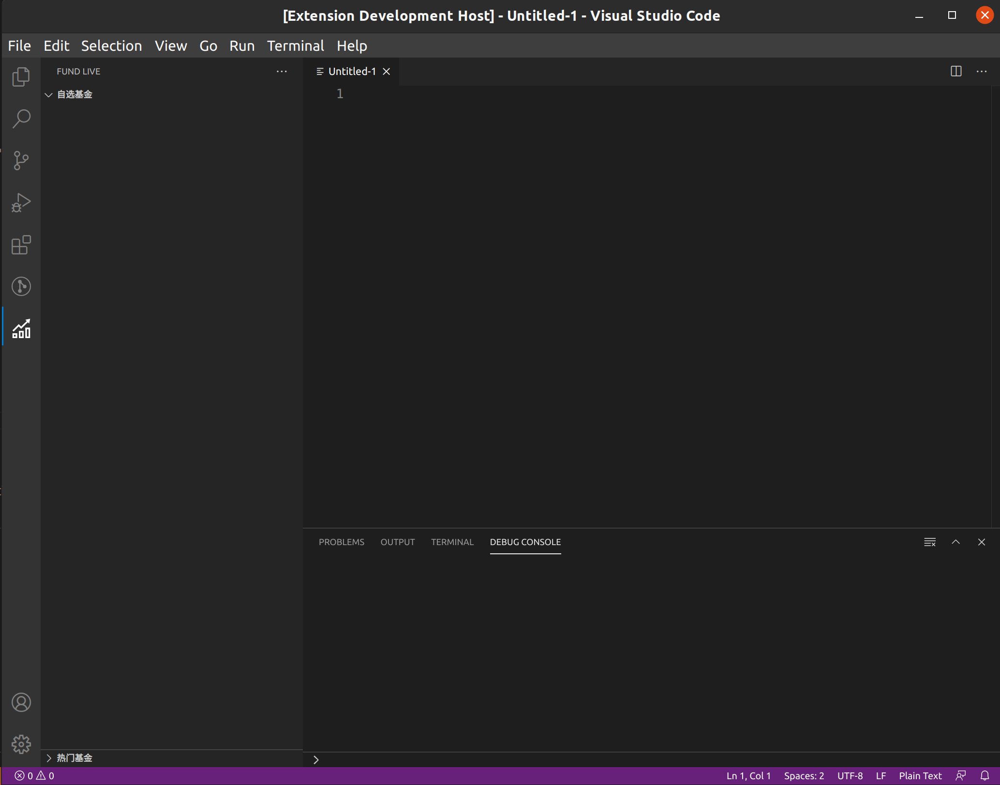
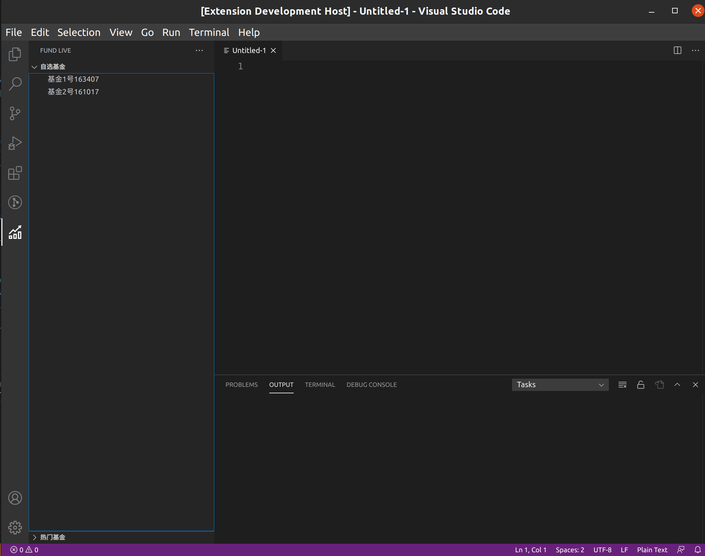
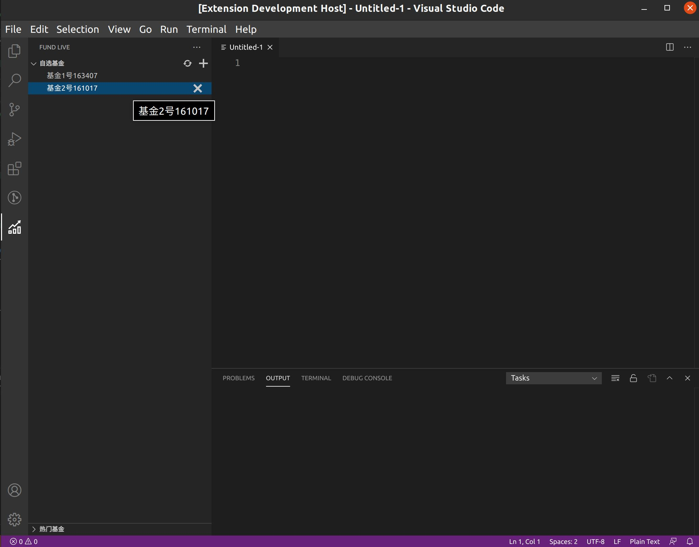

# VSCode插件获取基金实时数据

通过VSCode插件，获取并显示基金实时数据。



## 开发

### 初始化项目

安装VSCode插件脚手架yo，来快速搭建。参考[VSCode初始化项目官方文档](https://code.visualstudio.com/api/get-started/your-first-extension)

```sh
yarn global add  yo generator-code
```

生成项目

```sh
yo code
```

这里需要依次填入必要信息。我们取fund-live作为的项目名，用TypeScript开发，并且以yarn作为包管理，

```sh
? What type of extension do you want to create? New Extension (TypeScript)
? What's the name of your extension? fund-live
? What's the identifier of your extension? fund-live
? What's the description of your extension? 
? Initialize a git repository? Yes
? Which package manager to use? yarn
```

完成后旧可以进入项目文件夹，打开vscode进行开发了。

```h
cd fund-live
code .
```

按`F5`进行调试，使用`Ctrl+Shift+P`打开命令框，运行`Hello word`命令可以看到成功弹出通知信息。

### 添加新的侧边栏视图

工作区如图


如果要在侧边栏显示自定义插件视图，就配置`package.json`的`"contributes"`字段，添加插件视图容器`"viewsContainers"`字段和视图`"views"`字段。[扩展工作区官方文档](https://code.visualstudio.com/api/extension-capabilities/extending-workbench)

编辑`package.json`

```json
  "contributes": {
    "commands": [
      {
        "command": "fund-live.helloWorld",
        "title": "Hello World"
      }
    ],
    "viewsContainers": {
      "activitybar": [
        {
          "id": "fund-live",
          "title": "FUND LIVE",
          "icon": "images/fund-live.svg"
        }
      ]
    },
    "views": {
      "fund-live": [
        {
          "name": "自选基金",
          "id": "fund-favorite"
        },
        {
          "name": "热门基金",
          "id": "fund-tend"
        }
      ]
    }
  },
```

解释：

- `"viewsContainers"`：视图容器
  - `"activitybar"`：活动栏默认名称，即视图容器将放置在活动栏，该值数组包含视图容器对象
    - 视图容器对象必须属性
      - `"id"`：唯一id
      - `"title"`：标题 一般大写
      - `"icon"`：svg图标文件路径
- `"views"`：视图
  - `"fund-live"`：视图容器id，即视图放置在对应id的视图容器，该值数组包含视图对象
    - 视图对象属性
      - `"id"`：唯一id
      - `"name"`：名称

注意：

- 图标是必须的，如果没有可用的，可以去iconmonstr免费免注册下载，[传送门iconmonstr](https://iconmonstr.com/)，也可以下载本项目的图标。
- 没有视图的视图容器不会显示。
- 只有一个视图的视图容器，视图容器的标题和视图名称会合并显示。

运行结果：



### 添加插件的激活事件

我们希望打开视图时就激活。方法是配置`package.json`的`"activationEvents"`字段，声明插件的激活事件，激活后会执行插件入口文件`extension.js`的`active`方法。

编辑`package.json`

```json
"activationEvents": [
    "onCommand:fund-live.helloWorld",
    "onView:fund-favorite"
  ],
```

解释：

- `"activationEvents"`：激活事件字段
  -  `"onView:fund-favorite"`：表示在id为fund-favorite的视图渲染时触发

### 添加树视图数据源

树视图用来渲染数据，只需要实现一个父类为数据源类`TreeDataProvider`的子类，再在插件激活后调用的方法里将该子数据源类注册到对应视图id就可以了。

树视图渲染会先调用子类的getChildren()返回结果数组，并依次对数组的每个元素调用子类的getTreeItem()返回数据进行显示。

**新建`FundInfo.ts`**

```ts
export class FundInfo {
  name: string;
  code: string;

  constructor(name: string, code: string) {
    this.name = name;
    this.code = code;
  }
}
```

解释：

基金信息类，包含基金的各种属性，用来描述基金。

**新建`FundTreeItem.ts`**

```ts
import { TreeItem } from "vscode";
import { FundInfo } from "./FundInfo";

export class FundTreeItem extends TreeItem {
  constructor(info: FundInfo) {
    super(info.name + info.code);
  }
}
```

解释：

树元素类，需要继承`TreeItem`，并调用父类的构造函数来传入一个字符串，最终会被渲染出来。

**新建`FundTreeDataProvider.ts`**

```ts
import { TreeDataProvider } from "vscode";
import { FundInfo } from "./FundInfo";
import { FundTreeItem } from "./FundTreeItem";

export class FundTreeDataProvider implements TreeDataProvider<FundInfo> {
  getChildren() {
    console.log("getChildren");

    const f1 = new FundInfo("基金1", "111111");
    const f2 = new FundInfo("基金1", "222222");
    return [f1, f2];
  }

  getTreeItem(element: FundInfo) {
    console.log("getTreeItem");
    return new FundTreeItem(element);
  }
}
```

解释：

数据源类，需要继承`TreeDataProvider`，并实现两个方法。

- `getChildren`：渲染先调用，返回的结果数组的元素会被依次传入getTreeItem。
- `getTreeItem`：接收数据元素，需要返回一个`TreeItem`或其子类的实例。

**修改`extension.ts`**

```ts
  const fundProvider = new FundTreeDataProvider();
  vscode.window.registerTreeDataProvider("fund-favorite", fundProvider);
```

添加到active方法里，用于：

- 实例化自己的基金数据源
- 把数据源注册到视图上。

运行：


### 读写数据配置存储

我们可以把基金代码写入插件配置，保存使用。

> [Configuration](https://code.visualstudio.com/api/extension-capabilities/common-capabilities#configuration)
>
> An extension can contribute extension-specific settings with the [`contributes.configuration`](https://code.visualstudio.com/api/references/contribution-points#contributes.configuration) Contribution Point and read them using the [`workspace.getConfiguration`](https://code.visualstudio.com/api/references/vscode-api#workspace.getConfiguration) API.

编辑`package.json`

```json
    "configuration": {
      "type": "object",
      "title": "fund-live",
      "properties": {
        "fund-live.favorites": {
          "type": "array",
          "default": [
            "163407",
            "161017"
          ],
          "description": "自选基金列表，值为基金代码"
        }
      }
    }
```

添加`contributes.configuration`字段，说明如下：

- `configuration`：插件设置文件，使用json-schema格式配置。
  - `type`：类型
  - `title`：标题
  - `properties`：多个属性字段
    - `fund-live.favorites`：属性名
      - `type`：类型
      - `default`：默认值
      - `description`：描述

新建一个配置读写类，来操作配置

**新建`FundTreeItem.ts`**

```ts
import { workspace, WorkspaceConfiguration } from "vscode";

export class Config {
  private readonly config: WorkspaceConfiguration;

  constructor(public name: string) {
    this.config = workspace.getConfiguration();
    this.name = name;
  }

  getData(defaultValue: string): string;
  getData(defaultValue: number): number;
  getData(defaultValue: Array<string>): Array<string>;
  getData(defaultValue: Array<number>): Array<number>;
  getData(defaultValue: Array<any>): Array<any>;
  getData(defaultValue: any): any {
    return this.config.get(this.name, defaultValue);
  }

  setData(data: any): void {
    this.config.update(this.name, data, true);
  }
}

```

解释：

- `workspace.getConfiguration`获取配置对象。
- 根据传入的属性名使用`get`读`update`写。

下面在我们的数据源类里，进行读，取和刷新渲染

**修改`FundTreeDataProvider.ts`**

```ts
import { TreeDataProvider, EventEmitter, Event } from "vscode";
import { FundInfo } from "./FundInfo";
import { FundTreeItem } from "./FundTreeItem";
import { Config } from "./Config";

export class FundTreeDataProvider implements TreeDataProvider<FundInfo> {
  private favConfig: Config;
  refreshEvent: EventEmitter<FundInfo | null>;
  readonly onDidChangeTreeData: Event<FundInfo | null>;

  constructor() {
    this.favConfig = new Config("fund-live.favorites");
    this.refreshEvent = new EventEmitter<FundInfo | null>();
    this.onDidChangeTreeData = this.refreshEvent.event;
  }

  getChildren() {
    const codes = this.favConfig.getData([]);
    const res = codes.map((d, i) => new FundInfo(`基金${i + 1}号`, d));
    return res;
  }

  getTreeItem(element: FundInfo) {
    console.log("getTreeItem");
    return new FundTreeItem(element);
  }

  addCode(code: string) {
    const codes = this.favConfig.getData([]);
    codes.push(code);
    this.favConfig.setData(codes);
  }

  removeCode(code: string) {
    const codes = this.favConfig.getData([]);
    const index = codes.indexOf(code);
    codes.splice(index, 1);
    this.favConfig.setData(codes);
  }

  refresh() {
    console.log("refresh");
    setTimeout(() => {
      this.refreshEvent.fire(null);
    }, 200);
  }
}

```

解释：

- 私有一个配置字段`fund-live.favorites`的实例，并在构造函数里初始化。默认的事件变量初始化用于刷新视图。
- `getChildren`读取字段的基金代码数组。遍历生成基金实例
- 新的`addCode`用来添加基金代码并写入配置。
- 新的`removeCode`用来删除基金代码并写入配置。
- 新的`refresh`用来通知视图刷新。

运行：




### 添加新增、删除和刷新操作按钮

在字段`contributes.commands`里配置好命令，在字段`contributes.menus`配置显示出来，最后在`activate`方法里注册方法执行回调函数。

编辑`package.json`

```json
 "commands": [
      {
        "command": "fund.add",
        "title": "新增",
        "icon": {
          "light": "images/light/add-light.svg",
          "dark": "images/dark/add-dark.svg"
        }
      },
      {
        "command": "fund.refresh",
        "title": "刷新",
        "icon": {
          "light": "images/light/refresh-light.svg",
          "dark": "images/dark/refresh-dark.svg"
        }
      },
      {
        "command": "fund.item.remove",
        "title": "删除",
        "icon": {
          "light": "images/light/remove-light.svg",
          "dark": "images/dark/remove-dark.svg"
        }
      }
    ],
    "menus": {
      "view/title": [
        {
          "command": "fund.add",
          "when": "view == fund-favorite",
          "group": "navigation"
        },
        {
          "command": "fund.refresh",
          "when": "view == fund-favorite",
          "group": "navigation"
        }
      ],
      "view/item/context": [
        {
          "command": "fund.item.remove",
          "when": "view == fund-favorite",
          "group": "inline"
        }
      ]
    }
```

说明：

命令声明

-  `commands `：命令声明
   -  `command `：命令id
   -  `title `：标题
   -  `icon `：图标，由于深浅模式不同，必须有两套颜色
      -  `light `：一般只要修改svg的 `path `属性，添加 `fill="#424242"`来设置形状颜色深一点
      -  `dark `：一般只要修改svg的 `path `属性，添加 `fill="#C5C5C5" `来设置形状颜色浅一点

菜单布局

-  `menus`：菜单布局
   -  `view/title`：布置在视图标题栏
      - ` command`：命令id
      - `when`：显示在哪个视图上
      - `group`：导航栏上
   -  `view/item/context`：布置在树视图子元素内容
      -  `command`：命令id
      -  `when`：显示在哪个视图上
      -  `group`：内联元素上

 运行：



下面添加按钮逻辑。

**修改`extension.ts`**

```ts
import * as vscode from "vscode";
import { FundTreeDataProvider } from "./FundTreeDataProvider";
import { FundInfo } from "./FundInfo";

export function activate(context: vscode.ExtensionContext) {
  console.log('Congratulations, your extension "fund-live" is now active!');

  const fundProvider = new FundTreeDataProvider();
  vscode.window.registerTreeDataProvider("fund-favorite", fundProvider);

  let add = vscode.commands.registerCommand("fund.add", () => {
    async function handler() {
      const code = await inputFund();

      if (code) {
        console.log("input", code);
        fundProvider.addCode(code);
        fundProvider.refresh();
      } else {
        console.log("input empty,ignore.", code);
      }
    }

    handler().then();
  });

  let remove = vscode.commands.registerCommand(
    "fund.item.remove",
    (fund: FundInfo) => {
      fundProvider.removeCode(fund.code);
      fundProvider.refresh();
    }
  );

  let refresh = vscode.commands.registerCommand("fund.refresh", () => {
    fundProvider.refresh();
  });

  context.subscriptions.push(add, refresh, remove);
}

// this method is called when your extension is deactivated
export function deactivate() {}

async function inputFund() {
  const res = await vscode.window.showInputBox({
    value: "",
    valueSelection: [5, -1],
    prompt: "添加基金到自选",
    placeHolder: "Add Fund To Favorite",
    validateInput: (inputCode: string) => {
      const codeArray = inputCode.split(/[\W]/);
      const hasError = codeArray.some((code) => {
        return code !== "" && !/^\d+$/.test(code);
      });

      return hasError ? "基金代码输入有误" : null;
    },
  });

  return res;
}
```

说明：

- 注册`add`命令，新添加了一个`inputFund`方法，负责打开输入框获取用户输入，添加后刷新。
- 注册`remove`命令，接受当前元素，删除后刷新。
- 注册`refresh`命令，调用数据源的刷新。
- 添加到订阅。

到目前为止，已经完成了基金列表的随意增删的功能。

### 获取基金API数据

天天基金API

请求格式：

```txt
https://fundgz.1234567.com.cn/js/163407.js?rt=1598582673564
```

参数：

- `https://fundgz.1234567.com.cn/js/163407.js`：请求对应基金代码的url
- `?rt=1598582673564`：查询基金某时刻的信息，秒数。

响应为jsonp格式：

```txt
jsonpgz({"fundcode":"163407","name":"兴全沪深300指数(LOF)A","jzrq":"2020-08-27","dwjz":"2.5446","gsz":"2.5572","gszzl":"0.49","gztime":"2020-08-28 10:43"});
```

添加`fundapi.ts`

```ts
import * as https from "https";

//  `https://fundgz.1234567.com.cn/js/${code}.js?rt=${time}`;
const urlPrefix = `https://fundgz.1234567.com.cn/js/`;

/**
 * 拼接基金的请求地址和当前时间
 * @param code 基金代码
 */
function urlFull(code: string) {
  const realTime = Date.now();
  const res = urlPrefix + code + ".js?rt=" + realTime;

  return res;
}

/**
 * 获取基金信息
 * @param code 基金代码
 */
export async function show(code: string): Promise<any> {
  return new Promise((resolve, reject) => {
    https.get(urlFull(code), (res) => {
      let buffer: any;

      if (!res || res.statusCode !== 200) {
        reject(new Error("网络请求错误!"));
      }

      res.on("data", (d) => (buffer += d));

      res.on("end", () => {
        const jsonp = buffer.toString("utf8");

        const match = jsonp.match(/jsonpgz\((.+)\)/);
        if (!match || !match[1]) {
          reject(new Error("接口格式错误!"));
        }
        const str = match[1];
        const obj = JSON.parse(str);

        resolve(obj);
      });
    });
  });
}

/**
 * 并行获取多个基金信息
 * @param codes 基金代码数组
 */
export async function total(codes: string[]): Promise<any[]> {
  const parallel: Promise<any>[] = [];
  for (let i = 0; i < codes.length; i++) {
    parallel.push(show(codes[i]));
  }
  const resultArr: any[] = await Promise.all(parallel);

  return resultArr;
}
```

解释：

- `urlFull`方法：拼接url
- `show`方法：用原生https请求数据，处理响应数据的jsonp格式字符串，生成对象并返回
- `total`方法：并发获取基金信息

修改`FundInfo.ts`

```ts
export class FundInfo {
  /** 基金名称 */
  name: string;
  /** 基金代码 */
  code: string;
  /** 当前净值 */
  now: string;
  /** 昨日净值 */
  lastClose: string;
  /** 涨跌幅 */
  changeRate: string;
  /** 涨跌额 */
  changeAmount: string;

  constructor(
    name: string,
    code: string,
    now: string,
    lastClose: string,
    changeRate: string,
    changeAmount: string
  ) {
    this.name = name;
    this.code = code;
    this.now = now;
    this.lastClose = lastClose;
    this.changeRate = changeRate;
    this.changeAmount = changeAmount;
  }
}
```

解释：

丰富了基金类的属性。

修改`FundTreeItem.ts`

```ts
import { TreeItem } from "vscode";
import { FundInfo } from "./FundInfo";

export class FundTreeItem extends TreeItem {
  constructor(info: FundInfo) {
    const rate = Number(info.changeRate);
    const icon = rate >= 0 ? "📈" : "📉";
    const prev = rate >= 0 ? "+" : "-";
    const rage = `${prev}${Math.abs(rate)}%`;

    const title = icon + rage + "\t" + `[${info.code}]${info.name}`;

    /** 构造继承 */
    super(title);

    /** Tooltip鼠标悬停提示 */
    let sliceName = info.name;
    if (sliceName.length > 8) {
      sliceName = `${sliceName.slice(0, 8)}...`;
    }
    const tips = [
      `代码:　${info.code}`,
      `名称:　${sliceName}`,
      `--------------------------`,
      `单位净值:　　　　${info.now}`,
      `涨跌幅:　　　　　${info.changeRate}%`,
      `涨跌额:　　　　　${info.changeAmount}`,
      `昨收:　　　　　　${info.lastClose}`,
    ];

    this.tooltip = tips.join("\r\n");
  }
}
```

解释：

丰富了树视图元素显示的信息。

修改`FundTreeDataProvider.ts`

```ts
  async getChildren() {
    const codes = this.favConfig.getData([]);
    const funds = await total(codes);
    const res = funds.map(
      (d) =>
        new FundInfo(
          d.name,
          d.fundcode,
          d.gsz,
          d.dwjz,
          d.gszzl,
          (d.gsz - d.dwjz).toFixed(4)
        )
    );

    return res;
  }
```

解释：

- `getChildren方法`：改为异步，从网络获取数据后，对应实例化基金对象。

运行：


至此，基金插件开发完毕了。

## 总结

基金插件实现了基金代码的增删和保存，并可以刷新基金信息。

VSCode插件开发还是非常舒适的，有着良好的代码提示和调试体验，值得深入学习。

欢迎点赞关注，源码戳~[Github](https://github.com/czzonet/fund-live)

## 参考

1. [从零开始实现VS Code基金插件 - 掘金](https://juejin.im/post/6864712731484749831#heading-0)
2. [Extension API | Visual Studio Code Extension API](https://code.visualstudio.com/api)